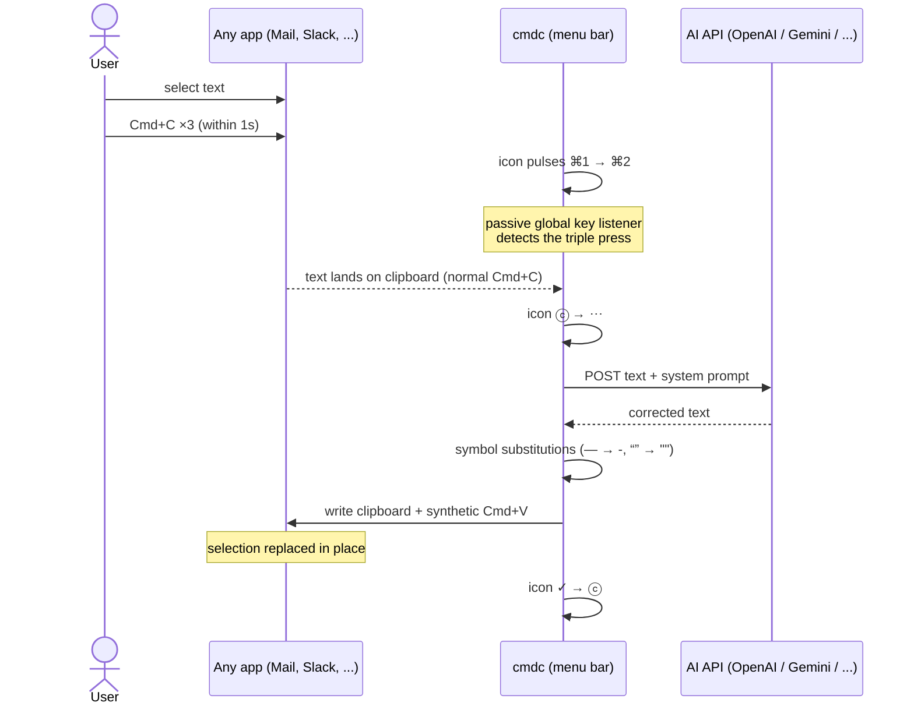

# cmdc — Triple Cmd+C for instant text correction

A macOS menu bar app (clone of [cmd-c.app](https://cmd-c.app/)): select text in **any** app, press **Cmd+C three times quickly** — AI fixes grammar, punctuation and style, and the corrected text is pasted back in place.

## How it works



## Setup

```bash
cd cmdc
uv sync
uv run cmdc
```

First run: macOS will ask for permissions for your terminal (or whatever launches cmdc):

- **System Settings → Privacy & Security → Input Monitoring** — to detect the triple Cmd+C
- **System Settings → Privacy & Security → Accessibility** — to send the synthetic Cmd+V

Restart cmdc after granting.

### API key

Picked up automatically from env (`OPENAI_API_KEY`, `GEMINI_API_KEY`, `ANTHROPIC_API_KEY` — already loaded by your Bitwarden shell setup), or set per provider via the menu bar → *Set API Key…* (stored in `~/.config/cmdc/config.json`, chmod 600).

Gemini defaults to `gemini-3.5-flash`. Existing configs that still have the
old bundled Gemini default (`gemini-2.5-flash`) are migrated on app startup.
For this correction flow, the built-in Gemini template sets
`thinkingConfig.thinkingLevel` to `minimal`, which is the Gemini 3.x setting
optimized for short, low-latency responses.

## Menu bar

| Item | What it does |
|---|---|
| **Enabled** | master on/off toggle (icon: ⓒ on / ⓒ̶ off) |
| **Provider** | openai / gemini / anthropic (radio) |
| **Model: …** | override the model (empty = provider default) |
| **Set API Key…** | per-provider key |
| **Edit Prompt…** | the system prompt sent with your text |
| **Replace symbols** | post-process: `—` `–` → `-`, curly quotes → straight, `…` → `...` |
| **Open Config File** | full config in your editor |
| **Open Log File** | recent app events and correction errors from `/tmp/cmdc.log` |

## Custom / any AI provider

Providers are plain **templates** in `~/.config/cmdc/config.json` — add any API that takes JSON and returns JSON:

```jsonc
"providers": {
  "myprovider": {
    "url": "https://api.example.com/v1/chat/completions",
    "headers": { "Authorization": "Bearer {api_key}" },
    "body": {
      "model": "{model}",
      "messages": [
        { "role": "system", "content": "{system_prompt}" },
        { "role": "user", "content": "{text}" }
      ]
    },
    "response_path": "choices.0.message.content",  // dot-path into response JSON
    "default_model": "my-model",
    "api_key_env": "MYPROVIDER_API_KEY"
  }
}
```

Placeholders: `{api_key}`, `{model}`, `{system_prompt}`, `{text}`. Most providers (OpenRouter, Groq, Ollama, Mistral, DeepSeek…) are OpenAI-compatible — copy the openai template and change `url`.

## Test without hotkeys

```bash
uv run cmdc-fix "this are a exemple of texts with mistake"
echo "some text" | uv run cmdc-fix
```

## Other config knobs

`~/.config/cmdc/config.json`: `trigger_count` (default 3), `trigger_window_sec` (1.0), `max_chars` (12000), `timeout_sec` (30), `substitutions` map.

## Installed as /Applications/cmdc.app

A thin wrapper bundle: a tiny compiled launcher (`Contents/MacOS/cmdc`) that
`exec`s `uv run --project ~/work/cmdc cmdc`. The Python code stays
editable here — restart the app to pick up changes:

```bash
pkill -f "cmdc/.venv/bin/python"; open -a cmdc
```

Notes:
- The main executable must be a real Mach-O binary — macOS 26 refuses to
  launch bundles whose executable is a shell script (error -10669).
  Source: `/tmp/cmdc_launcher.c` pattern, ad-hoc signed (`codesign -s -`).
- TCC permissions (Input Monitoring + Accessibility) are granted to **cmdc**
  in System Settings → Privacy & Security.
- Starts at login: added to Login Items (System Settings → General →
  Login Items), hidden. Logs: `/tmp/cmdc.log`.

## Roadmap

- **Triple Cmd+D** → popup window to type a custom instruction, then paste the result. The hotkey layer (`cmdc/hotkey.py`) already maps combos→actions, so this is just adding `"d": callback` plus the window.
