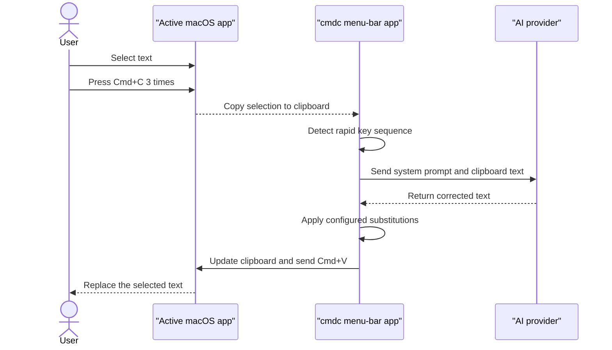

# cmdc

Instant AI text correction anywhere on macOS with a triple press of **Cmd+C**.

Select text in any app, press **Cmd+C** 3 times within 1 second, and cmdc sends
the copied text to your chosen AI provider. The corrected result is placed on
the clipboard and pasted over the original selection.

## Features

- Works in any macOS app that supports copy and paste.
- Supports OpenAI, Gemini, Anthropic, and custom JSON APIs.
- Provides an editable system prompt and per-provider model selection.
- Stores API keys locally or reads them from environment variables.
- Optionally normalizes dashes, quotation marks, and ellipses.
- Shows trigger and processing status in the menu bar.
- Includes a CLI for testing the correction pipeline without global hotkeys.

## Requirements

- macOS
- Python 3.11 or later
- [uv](https://docs.astral.sh/uv/)
- An API key for at least one supported provider

cmdc also needs 2 macOS permissions:

- **Input Monitoring** to detect the global Cmd+C sequence.
- **Accessibility** to paste the corrected text into the active app.

## Quick start

```bash
git clone https://github.com/gunkow/cmdc.git
cd cmdc
uv sync
uv run cmdc
```

On first launch, grant the required permissions under **System Settings →
Privacy & Security**, then restart cmdc.

Choose a provider from the menu bar and set its API key with **Set API Key…**.
Alternatively, export one of the supported environment variables before
launching cmdc:

| Provider | Environment variable | Default model |
|---|---|---|
| OpenAI | `OPENAI_API_KEY` | `gpt-5.4-mini` |
| Gemini | `GEMINI_API_KEY` | `gemini-3.5-flash` |
| Anthropic | `ANTHROPIC_API_KEY` | `claude-haiku-4-5-20251001` |

When cmdc is launched from Finder or Login Items, shell environment variables
may not be available. In that case, save the key through the menu bar.

## Usage

1. Select text in any application.
2. Press **Cmd+C** 3 times within 1 second.
3. Wait for the menu-bar icon to change from `⌘…` to `⌘✓`.
4. The corrected text replaces the selection automatically.

### Menu bar

| Item | Description |
|---|---|
| **Enabled** | Enables or disables the global trigger. |
| **Provider** | Selects OpenAI, Gemini, Anthropic, or a configured custom provider. |
| **Model: …** | Overrides the provider's default model. Leave it empty to use the default. |
| **Set API Key…** | Saves an API key for the selected provider. |
| **Edit Prompt…** | Opens the system-prompt editor. Enter inserts a line break; **Save** applies it. |
| **Replace symbols** | Converts typographic dashes, quotes, and ellipses to configured replacements. |
| **Open Config File** | Opens the complete JSON configuration. |
| **Open Log File** | Opens the current log at `/tmp/cmdc.log`. |

## Configuration

Configuration is stored in `~/.config/cmdc/config.json` with file mode `0600`.
The app creates this file from its defaults on first launch and updates it when
settings are changed through the menu bar.

Common settings include:

| Setting | Default | Description |
|---|---:|---|
| `trigger_count` | `3` | Number of rapid Cmd+C presses required. |
| `trigger_window_sec` | `1.0` | Time window for the trigger sequence. |
| `max_chars` | `12000` | Maximum clipboard-text length sent to the provider. |
| `timeout_sec` | `30` | HTTP request timeout in seconds. |
| `substitutions_enabled` | `true` | Enables response post-processing. |
| `substitutions` | built-in map | Character replacements applied before pasting. |

Gemini uses `thinkingLevel: minimal` by default to keep short correction calls
responsive. Existing configurations that still use the old bundled
`gemini-2.5-flash` default are migrated automatically.

### Custom providers

Provider integrations are JSON request templates. Any API that accepts JSON and
returns JSON can be added under `providers` in the config file:

```jsonc
{
  "providers": {
    "myprovider": {
      "url": "https://api.example.com/v1/chat/completions",
      "headers": {
        "Authorization": "Bearer {api_key}",
        "Content-Type": "application/json"
      },
      "body": {
        "model": "{model}",
        "messages": [
          { "role": "system", "content": "{system_prompt}" },
          { "role": "user", "content": "{text}" }
        ]
      },
      "response_path": "choices.0.message.content",
      "default_model": "my-model",
      "api_key_env": "MYPROVIDER_API_KEY"
    }
  }
}
```

Available placeholders are `{api_key}`, `{model}`, `{system_prompt}`, and
`{text}`. `response_path` is a dot-separated path into the response JSON; list
indexes are written as numbers, for example `choices.0.message.content`.

## Command-line usage

Use `cmdc-fix` to test the active provider, prompt, and substitutions without
the menu-bar app:

```bash
uv run cmdc-fix "this are a example with mistakes"
echo "some text" | uv run cmdc-fix
```

## How it works



The system prompt and clipboard text are sent as separate request fields. The
exact provider request and response shapes are defined in `cmdc/config.py`.

## Troubleshooting

### The trigger is not detected

Grant Input Monitoring permission to the process that launches cmdc. If you
switch between a terminal launch and an application bundle, macOS may treat
them as different permission identities.

### The result is generated but not pasted

Grant Accessibility permission to cmdc, then restart it.

### The API key is not found

Set the key through **Set API Key…**. Apps launched from Finder or Login Items
do not necessarily inherit variables from your interactive shell.

### A correction fails

Open **Open Log File** from the menu bar or inspect `/tmp/cmdc.log`:

```bash
tail -f /tmp/cmdc.log
```

## Development

The project is intentionally small:

| Module | Responsibility |
|---|---|
| `cmdc/app.py` | Menu-bar UI and correction workflow. |
| `cmdc/hotkey.py` | Global multi-press detection. |
| `cmdc/clipboard.py` | Clipboard access and synthetic Cmd+V. |
| `cmdc/ai.py` | Provider-independent HTTP request handling. |
| `cmdc/config.py` | Defaults, persistence, migrations, and provider templates. |
| `cmdc/cli.py` | Command-line entry point. |

Run a basic source check with:

```bash
uv run python -m compileall cmdc
git diff --check
```

Restart the menu-bar app after changing the source.

## Roadmap

- Add a separate global shortcut for one-off custom instructions.

## Acknowledgements

Inspired by [cmd-c.app](https://cmd-c.app/).
